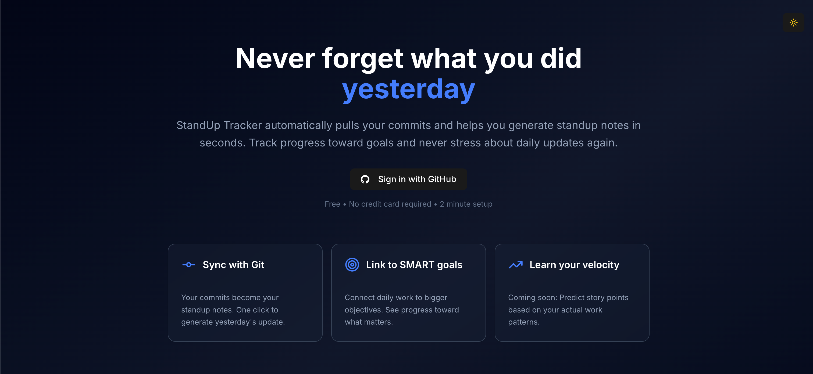

# StandUp Tracker

Never forget what you were working on yesterday.

StandUp Tracker helps developers track daily progress by pulling GitHub commits and turning them into standup notes. No more "what did I do yesterday?" Your commits already know.

Meetings have their place. Routine status updates don't need to be one of them. Your team stays in sync, you stay focused on the work.

Built for async teams, remote developers, and people who respect each other's time.



## Features

- [X] **Auto-populate from Git** - Your commits become your standup notes with one click
- [X] **Async by default** - Write updates on your schedule, not meeting schedules
- [X] **Full CRUD operations** - Create, view, edit, and delete standup notes
- [X] **Markdown support** - Format your notes with markdown for better readability
- [X] **Date range selection** - Fetch commits from any date range (perfect for Monday standups)
- [X] **Clean history view** - Scannable list of past standups with summaries
- [X] **Persistent storage** - All standups saved to Neon Postgres database
- [X] **Secure OAuth** - GitHub authentication with token encryption

## Demo

[Live Demo](https://standup-tracker-indol.vercel.app)

## Tech Stack

### Frontend
- **React 18** + **TypeScript** - Type-safe component architecture
- **Vite** - Lightning-fast build tool
- **Tailwind CSS v4** - Utility-first styling with Typography plugin
- **Framer Motion** - Smooth animations
- **shadcn/ui** + **Radix UI** - Accessible components
- **Zustand** - Lightweight state management with persistence
- **React Router** - Client-side routing
- **React Markdown** - Markdown rendering for standup notes

### Backend
- **Vercel Serverless Functions** - RESTful API endpoints
- **Neon Postgres** - Serverless database
- **Drizzle ORM** - Type-safe database queries
- **GitHub API (Octokit)** - Repository and commit data

### DevOps
- **Vercel** - Deployment and hosting
- **GitHub OAuth Apps** - Secure authentication

## Installation

### Prerequisites
- Node.js 18+ and npm
- GitHub account
- Vercel account (for deployment)

### Local Development

1. **Clone the repository**
```bash
git clone https://github.com/RBazelais/Standup-Tracker.git
cd Standup-Tracker
```

2. **Install dependencies**
```bash
npm install
```

3. **Set up GitHub OAuth App**
   - Go to [GitHub Developer Settings](https://github.com/settings/developers)
   - Click "New OAuth App"
   - Fill in:
     - **Application name:** StandUp Tracker Local Dev
     - **Homepage URL:** `http://localhost:3000`
     - **Authorization callback URL:** `http://localhost:3000/auth/callback`
   - Copy your **Client ID** and **Client Secret**

4. **Set up Neon Database**
   - Create a Neon project at [neon.tech](https://neon.tech)
   - Copy your connection string

5. **Configure environment variables**
   
   Create `.env.local`:
```env
# GitHub OAuth
VITE_GITHUB_CLIENT_ID=your_client_id_here
GITHUB_CLIENT_SECRET=your_client_secret_here
VITE_APP_URL=http://localhost:3000

# Neon Database
POSTGRES_URL=your_neon_connection_string
```

6. **Run database migrations**
```bash
npm run db:push
```

7. **Run the development server**
```bash
npm install -g vercel  # Install Vercel CLI (if not already installed)
vercel dev             # Run with serverless functions
```

8. **Open your browser**
   
   Navigate to `http://localhost:3000`

## Deployment

### Deploy to Vercel

1. **Push to GitHub**
```bash
git push origin main
```

2. **Import to Vercel**
   - Go to [Vercel Dashboard](https://vercel.com/dashboard)
   - Click "New Project"
   - Import your GitHub repository
   - Vercel will auto-detect Neon and set up database connection
   - Add remaining environment variables:
     - `VITE_GITHUB_CLIENT_ID`
     - `GITHUB_CLIENT_SECRET`
     - `VITE_APP_URL` (your Vercel URL)

3. **Update GitHub OAuth App**
   - Update callback URL to: `https://your-app.vercel.app/auth/callback`

4. **Deploy**
   
   Vercel will automatically deploy on every push to `main`

## Usage

1. **Sign in with GitHub** - Authorize StandUp Tracker to access your repositories
2. **Select a repository** - Choose which project you want to track
3. **Create a standup note**:
   - Select date range for commits (defaults to yesterday)
   - Click "Auto-populate" to fill in your work from commits
   - Add your plans for today
   - Note any blockers (optional)
4. **View history** - Browse past standups with clean, scannable summaries
5. **Edit or delete** - Click any standup to view details, then edit or delete as needed

## Architecture

### Database Schema
```typescript
// Standups table
{
  id: uuid,
  userId: string,           // GitHub user ID
  repoFullName: string,     // e.g., "username/repo"
  date: string,             // YYYY-MM-DD
  yesterday: string,        // Markdown-formatted
  today: string,            // Markdown-formatted
  blockers: string,         // Markdown-formatted
  commits: jsonb,           // Full commit data
  taskIds: jsonb,           // Array of linked task IDs
  createdAt: timestamp,
  updatedAt: timestamp
}
```

### API Routes

| Method | Endpoint | Description |
|--------|----------|-------------|
| GET | `/api/standups?userId={id}` | Fetch all standups for user |
| POST | `/api/standups?userId={id}` | Create new standup |
| GET | `/api/standups/{id}` | Fetch single standup |
| PUT | `/api/standups/{id}` | Update standup |
| DELETE | `/api/standups/{id}` | Delete standup |

## Roadmap

### Phase 1: Core Features (Complete)
- [X] GitHub OAuth authentication
- [X] Repository selection
- [X] Standup form with commit auto-population
- [X] Date range selector for commits
- [X] Markdown support
- [X] Standup history view
- [X] Full CRUD operations
- [X] Database persistence with Neon Postgres

### Phase 2: Task Management (In Progress)
- [ ] Link standups to tasks/tickets
- [ ] Story point tracking
- [ ] Velocity insights

### Future Ideas
- Team workspaces and shared standups
- Slack/Discord notifications
- Jira/Asana/Linear integrations
- Export to Markdown

## Contributing

Contributions welcome! Fork the repo, create a feature branch, and open a PR.

## License

MIT License - see [LICENSE](LICENSE) for details.

## Author

Rachél Bazelais
- Portfolio: [rbazelais.com](https://rbazelais.com)
- GitHub: [@RBazelais](https://github.com/RBazelais)
- LinkedIn: [rbazelais](https://linkedin.com/in/rbazelais)