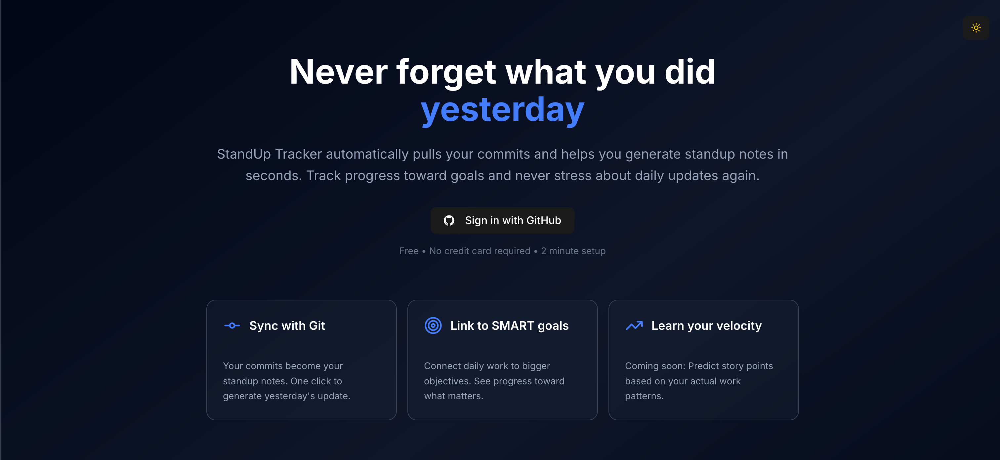

# StandUp Tracker

> Auto-populate standup notes from GitHub commits with smart selection and instant feedback

Never forget what you were working on yesterday. Your commits already know.

Built for async teams, remote developers, and people who respect each other's time.

**[Live Demo](https://standup-tracker-indol.vercel.app)** • **[Portfolio](https://rbazelais.com)**



---

## Features

- [x] **Smart commit selection** - Day grouping, branch filtering, bulk operations
- [x] **Optimistic UI** - Instant feedback with automatic rollback on errors
- [x] **Async by default** - Write updates on your schedule, not meeting schedules
- [x] **Hierarchical planning** - Milestones, sprints, tasks, and standups
- [x] **Full CRUD** - Create, view, edit, and delete with toast notifications
- [x] **Markdown support** - Format notes with markdown for readability
- [x] **GitHub OAuth** - Secure authentication with token persistence
- [x] **Jira OAuth** - Connect a Jira workspace and manage the integration from Settings
- [x] **Task linking** - Link GitHub issues to standups with auto-detection and search
- [x] **Database persistence** - Neon Postgres with type-safe queries via Drizzle ORM
- [x] **Keyboard accessible** - Skip links, focus management on route transitions, WCAG 2.4 compliant dialogs
- [x] **E2E tested** - Playwright test suite running against real Vercel preview deployments on every PR

---

## Tech Stack

### Frontend

- **React 18 + TypeScript** - Type-safe component architecture
- **Vite** - Lightning-fast build tool
- **React Query (TanStack Query)** - Server state management with optimistic updates
- **Zustand** - Client state management (auth, UI selections)
- **Tailwind CSS** - Utility-first styling with semantic color tokens
- **Radix UI** - Accessible component primitives
- **Framer Motion** - Smooth animations with reduced-motion support
- **React Router** - Client-side routing

### Backend

- **Vercel Serverless Functions** - RESTful API endpoints
- **Neon Postgres** - Serverless PostgreSQL database
- **Drizzle ORM** - Type-safe SQL queries
- **GitHub API** - Repository and commit data
- **Atlassian OAuth 2.0 (3LO)** - Jira integration with token refresh

### Testing

- **Playwright** - E2E tests against Vercel preview deployments
- **Vitest** - Unit tests for API handlers and utility functions
- **GitHub Actions** - CI pipeline: type check, unit tests, then E2E, gated in order

### DevOps

- **Vercel** - Deployment, hosting, and preview environments
- **GitHub Actions** - Automated CI on every pull request

---

## Architecture

### State Management Strategy

Separated client state from server state for optimal performance and developer experience:

**Zustand (Client State - 1KB):**

- Auth tokens and user session (persisted to localStorage)
- UI selections (selected repo, branch)
- Synchronous, always available

**React Query (Server State - 13KB):**

- Standups, commits, branches (fetched from API)
- Automatic caching and background sync
- Optimistic updates with automatic rollback
- Built-in error handling and retries

**Trade-off:** Added 14KB bundle size but eliminated roughly 200 lines of manual cache invalidation, optimistic update logic, and error handling per resource.

### Database Schema

```typescript
// Core schema
standups
├── id (uuid)
├── user_id (text)
├── work_completed (text)
├── work_planned (text)
├── blockers (text)
├── commits (jsonb)
├── task_ids (jsonb)
└── timestamps

// Hierarchical planning
milestones (long-term goals)
  └── sprints (time-boxed iterations)
        └── tasks (individual work items)
              └── standups (daily updates)

// Integrations
integrations
├── user_id (text)
├── source (text)         -- "github" | "jira"
├── access_token (text)
├── refresh_token (text)
├── token_expires_at (timestamp)
├── account_name (text)
└── metadata (jsonb)      -- cloudId, siteName for Jira
```

### API Routes

| Method | Endpoint | Description |
| --- | --- | --- |
| GET | `/api/standups?userId={id}` | Fetch all standups for user |
| POST | `/api/standups?userId={id}` | Create new standup |
| GET | `/api/standups/{id}` | Fetch single standup |
| PUT | `/api/standups/{id}` | Update standup |
| DELETE | `/api/standups/{id}` | Delete standup |
| GET | `/api/milestones?userId={id}` | Fetch milestones |
| POST | `/api/milestones?userId={id}` | Create milestone |
| GET | `/api/milestones/{id}` | Fetch single milestone |
| PUT | `/api/milestones/{id}` | Update milestone |
| GET | `/api/sprints?milestoneId={id}` | Fetch sprints for milestone |
| POST | `/api/sprints?milestoneId={id}` | Create sprint |
| PUT | `/api/sprints/{id}` | Update sprint |
| GET | `/api/tasks?userId={id}` | Fetch tasks |
| POST | `/api/tasks?userId={id}` | Create task or run linking action |
| GET | `/api/tasks/{id}` | Fetch single task |
| PUT | `/api/tasks/{id}` | Update task |
| GET | `/api/integrations?userId={id}&source={s}` | Check integration status |
| DELETE | `/api/integrations?userId={id}&source={s}` | Disconnect integration |
| GET | `/api/auth/callback` | GitHub OAuth callback |
| GET | `/api/auth/jira` | Jira OAuth redirect initiator |
| GET | `/api/auth/jira/callback` | Jira OAuth callback |

---

## Technical Challenges

### 1. Optimistic UI with race-safe rollback

When a user creates or edits a standup, the app updates the screen immediately without waiting for the server. If the request fails, the UI rolls back to exactly what it was before. The subtlety is that a naive rollback restores the current cache state, which may have changed if another request landed in the meantime. The correct approach is to snapshot the cache before the mutation fires and restore that specific snapshot on failure.

The `cancelQueries` call is the detail that makes this safe: it cancels any in-flight background refetches before the optimistic update lands, preventing a stale server response from overwriting the snapshot.

```typescript
onMutate: async (newStandup) => {
  await queryClient.cancelQueries({ queryKey: ['standups', user?.id] });
  const previousStandups = queryClient.getQueryData(['standups', user?.id]);
  queryClient.setQueryData(['standups', user?.id], (old) => [
    { ...newStandup, id: crypto.randomUUID(), createdAt: new Date() },
    ...old,
  ]);
  return { previousStandups };
},
onError: (_err, _vars, context) => {
  queryClient.setQueryData(['standups', user?.id], context.previousStandups);
},
```

---

### 2. Testing an OAuth-gated app in CI

Every pull request runs a Playwright suite against a real Vercel preview deployment, including the authenticated dashboard and task-linking flow. The challenge was that GitHub OAuth requires a human in the loop and can't run headlessly.

The solution was to inject Zustand's persisted auth state directly into `localStorage` before navigation, then intercept API calls with realistic mock responses. This let the tests exercise the full authenticated UI without touching the real OAuth flow.

A harder problem came from Playwright's route interception: handlers evaluate in last-registered-first-served order. When a broad URL pattern was registered after a specific one, it would intercept the specific URL and return the wrong shape, crashing the React tree with no obvious error message.

```typescript
// Broad pattern registered first so the specific one wins
await page.route('**/api/standups**', (route) =>
  route.fulfill({ json: [MOCK_STANDUP] })
);
await page.route(`**/api/standups/${STANDUP_ID}`, (route) =>
  route.fulfill({ json: MOCK_STANDUP })
);
```

---

### 3. Keyboard accessibility as a system of failure modes

Accessibility work surfaced as a series of silent failures that were invisible to mouse users and only caught by testing with a keyboard.

The skip link scrolled the page without moving focus because the target `<main>` element is not focusable by default. Adding `tabindex="-1"` made it reachable programmatically without inserting it into the natural tab order. A dialog's focus was dropping to `document.body` on close because the dialog was opened via state rather than through Radix UI's trigger component, so Radix had no record of what to return focus to. And a `FocusOnRouteChange` component was stealing focus on page load because a `useRef(true)` first-render guard is defeated by React StrictMode, which runs effects twice on mount.

That last fix changed the question the component was asking:

```tsx
const prevPathnameRef = useRef(pathname);
useEffect(() => {
  const prev = prevPathnameRef.current;
  prevPathnameRef.current = pathname;
  if (prev === pathname) return;  // no-op on mount and StrictMode's second run
  document.getElementById('main-content')?.focus();
}, [pathname]);
```

Instead of "is this the first render?", it asks "did the route actually change?" — a question StrictMode cannot interfere with.

---

### 4. OAuth state across stateless serverless functions

The Jira integration required a three-legged OAuth flow split across two serverless functions: one to start the redirect and one to handle the callback after Jira sends the user back. Serverless functions share no memory between invocations, so there was no built-in way to pass the user's identity or the CSRF token from one to the other.

A database write would work but adds a roundtrip for data that only needs to live ten minutes. The right tool was already there: the browser's cookie jar, which both functions share without any extra infrastructure. The redirect function encodes both values into a short-lived HttpOnly cookie. The browser holds it automatically and sends it back when Jira redirects to the callback.

```typescript
// Redirect: pack state + userId into a cookie before sending the user to Atlassian
const state = crypto.randomUUID();
res.setHeader('Set-Cookie',
  `jira_oauth_state=${encodeURIComponent(JSON.stringify({ state, userId }))}; HttpOnly; SameSite=Lax; Path=/; Max-Age=600`
);

// Callback: validate, use, discard
if (state !== cookieData.state) {
  return res.status(400).json({ error: 'State mismatch: possible CSRF attack' });
}
res.setHeader('Set-Cookie', 'jira_oauth_state=; Max-Age=0');
```

The cookie does double duty: the `state` field is the CSRF check, and `userId` tells the callback which user just connected.

---

## Installation

### Prerequisites

- Node.js 18+ and npm
- GitHub account (required)
- Jira account with an Atlassian OAuth app (optional)
- Vercel account (for deployment)

### Local Development

1. **Clone and install**

```bash
git clone https://github.com/RBazelais/Standup-Tracker.git
cd Standup-Tracker
npm install
```

2. **Set up GitHub OAuth App**
   - Go to [GitHub Developer Settings](https://github.com/settings/developers)
   - Create new OAuth App:
     - Homepage URL: `http://localhost:3000`
     - Callback URL: `http://localhost:3000/auth/callback`
   - Copy Client ID and Secret

3. **Set up Neon Database**
   - Create project at [neon.tech](https://neon.tech)
   - Copy connection string

4. **Configure environment variables**

Create `.env.local`:
```env
# GitHub OAuth
VITE_GITHUB_CLIENT_ID=your_client_id
GITHUB_CLIENT_SECRET=your_client_secret
VITE_APP_URL=http://localhost:3000

# Database
POSTGRES_URL=your_neon_connection_string

# Jira OAuth (optional)
JIRA_CLIENT_ID=your_atlassian_client_id
JIRA_CLIENT_SECRET=your_atlassian_client_secret
```

5. **Run database migrations**
```bash
npm run db:push
```

6. **Start development server**
```bash
npm install -g vercel  # Install Vercel CLI
vercel dev             # Run with serverless functions
```

7. **Open browser** at `http://localhost:3000`

---

## Deployment

### Deploy to Vercel

1. Push to GitHub
2. Import repository to Vercel
3. Add environment variables (Vercel auto-detects Neon)
4. Update GitHub OAuth callback URL to production URL
5. Deploy (automatic on every push to main)

---

## Usage

1. **Sign in with GitHub** - Authorize repository access
2. **Select repository** - Choose project to track
3. **Select branch** (optional) - Filter commits by branch
4. **Create standup**:
   - Select date range (presets: Yesterday, Last Friday, This Week)
   - Review commits grouped by day
   - Deselect noise commits
   - Click "Auto-populate" to fill work completed
   - Add plans and blockers
5. **Link tasks** - Search or auto-detect GitHub issues related to your commits
6. **Connect Jira** - Go to Settings and authorize your Jira workspace
7. **View history** - Browse past standups
8. **Edit or delete** - Click any standup for details

---

## Roadmap

### Phase 1: Core Features

- [x] GitHub OAuth authentication
- [x] Smart commit selection with day grouping
- [x] Branch filtering
- [x] Optimistic UI with React Query
- [x] Database persistence
- [x] Full CRUD operations
- [x] CI/CD pipeline with Playwright E2E against Vercel previews

### Phase 2: Task Management and Integrations

- [x] Database schema with milestones, sprints, and tasks
- [x] Link standups to GitHub issues with auto-detection and search
- [x] Jira OAuth (connect, disconnect, token refresh)
- [ ] Fetch and link Jira issues to standups
- [ ] Story point tracking
- [ ] Sprint velocity insights

### Future Ideas

- [ ] AI commit summarization (Claude API)
- [ ] Slack or Discord integration
- [ ] Linear sync
- [ ] Export as Markdown
- [ ] Weekly summary reports

---

## Contributing

Contributions welcome. Fork, create a feature branch, and open a PR.

---

## License

MIT License - see [LICENSE](LICENSE) for details.

---

## Author

**Rachel Bazelais**
Frontend Engineer specializing in React, TypeScript, and UI engineering

- [rbazelais.com](https://rbazelais.com)
- [LinkedIn](https://linkedin.com/in/rbazelais)
- [GitHub](https://github.com/RBazelais)
